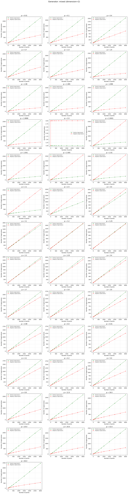
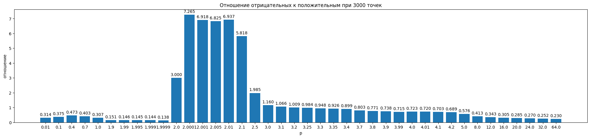

# Исследование отношения отрицательных собственных значений к положительным

## Введение

Попытка в анализ спектральных свойств матрицы квадратов расстояний по метрике Минковсвого с разными значениями параметра p и разными размерностями. Наиболее интересующий вопрос - это отношение количества орицательных собственных значений к положительным.

## Замечания

Для анализа было выбрано смешанное распределение (как показал другой эсперимент, изменение распределения ведёт максимум только к занулению каких-то собственных значений, но не изменению их отношения как такового). 

## Интересные замечания о линейных графиках

На изначальной размерности данных 2 можно в пределах вычислительных возможностей увидеть следующее поведение: при росте p от 0 до 2 количество отрицательных СЗ (собственных значений) падает, в p = 2 мы совпадаем с Евклидовой метрикой, после p = 2 количество отрицательных и положительных собственных значений меняется местами, после чего с увеличением p отношение отрицательных собственных значений к положительным будет падать. Такое поведение прослеживается при любой размерности. 

## Результаты

Здесь просто вывалим все результаты отношений отицательных СЗ к положительным в зависимости от параметра p.  

### Размерность m = 2 

### Размерность m = 3
![](./images/График3.png

### Размерность m = 4
![](./images/График4.png

### Размерность m = 5
![](./images/График5.png

### Размерность m = 7
![](./images/График7.png

### Размерность m = 10
![](./images/График10.png

### Размерность m = 15
![](./images/График15.png

### Размерность m = 20
![](./images/График20.png

### Размерность m = 50
![](./images/График50.png

### Размерность m = 100
![](./images/График100.png

### Размерность m = 500
![](./images/График500.png

### Размерность m = 1000
![](./images/График1000.png
